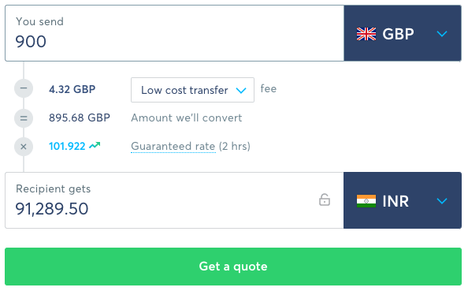
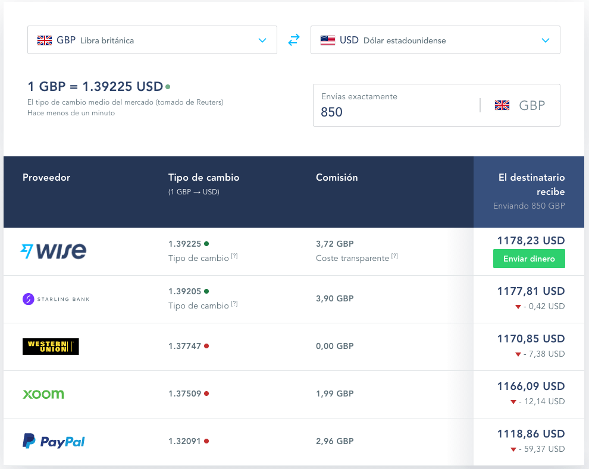

# Wise Public Widgets

The Wise public widgets provide an easy way to embed rich, interactive content onto your website. All the Wise widgets feature powerful configuration options to enable you to tailor their functionality to suit your audience. By including your [personal affiliate link](https://wise.com/gb/affiliate-program/) in the code, it's also possible to use the widgets to generate commission from visitors to your website.

There are two available widgets:

- **Calculator**: A currency exchange calculator with route selection, real-time exchange rate, and a transfer quote.
- **Comparison**: A money transfer comparison table, with or without selectors for the route and amount.

The default calculator looks like this:


The default comparison table looks like this:


## Adding the calculator widget to your site

### 1. Add the HTML tag

Place the following code onto your page where you want the calculator widget to appear:
```html
<div id="wise-calc-widget">
<!-- calculator will be rendered here -->
</div>
```

### 2. Add the calculator script tag

Add the following JavaScript code to your page immediately before the closing `</body>` tag:
```html
<script type="text/javascript">
(function() {
  window.onload = function() {
    /* Change the variables below */
    var sourceCurrencyCode = "AUD";
    var targetCurrencyCode = "USD";
    var sourceAmount = 2500;
    var callToActionLabel = "Get started";
    var hideCta = false;
    var hideDetails = false;
    var affiliateLink = "YOUR_TRACKING_LINK";
    var lang = "en";
    var width = "580px";
    var height = "470px";
    /* Do not modify the code below */
    var redirectUrlParams = encodeURIComponent("https://wise.com?sourceCurrency=" + sourceCurrencyCode + "&targetCurrency=" + targetCurrencyCode + "&fromCalcWidget=true&sourceAmount=" + sourceAmount);
    var redirectUrl = encodeURIComponent(affiliateLink + "?u=" + redirectUrlParams);
    var wiseIframeUrl =
      "https://wise.com/widget/calculator?sourceCurrencyCode=" + sourceCurrencyCode + "&targetCurrencyCode=" + targetCurrencyCode + "&amount=" + sourceAmount + "&cta=" + callToActionLabel + "&hideCta=" + hideCta + "&hideDetails=" + hideDetails + "&redirectUrl=" + redirectUrl + "&lang=" + lang + "&theme=light"
    var wiseIframe = document.createElement('iframe');wiseIframe.frameBorder = 0;wiseIframe.width = width;wiseIframe.height = height;wiseIframe.id = "wise-calc";wiseIframe.scrolling = "no";wiseIframe.setAttribute("allowtransparency", "true");wiseIframe.setAttribute("src", wiseIframeUrl);
    document.getElementById("wise-calc-widget").appendChild(wiseIframe);
  };
})();
</script>
```

### 3. Configure the script tag

Note the variables at the start of the script tag above. These can be changed to suit your requirements, according to the table below. Examples of various setups are shown later in this guide.

| Variable           | Description                                     | Example                                     |
|--------------------|-------------------------------------------------|---------------------------------------------|
| `sourceCurrencyCode` | Set the source currency                         | `"EUR"`, `"GBP"`, `"USD"`, `"INR"`, etc                     |
| `targetCurrencyCode` | Set the target currency                         | `"EUR"`, `"GBP"`, `"USD"`, `"INR"`, etc                     |
| `sourceAmount`       | Set the initial value of money to be converted  | `1000`                                        |
| `callToActionLabel`  | Set the value of the CTA button                 | `"Get started"`                                 |
| `hideCta`            | Set to true to hide the call to action button   | `true` or `false`                               |
| `hideDetails`        | Set to true to hide the rate, savings, etc      | `true` or `false`                               |
| `affiliateLink`      | Your [affiliate link](https://wise.com/gb/affiliate-program/)                             | `"https://wise.prf.hn/click/camref:11001XXXX"` |
| `lang`               | Sets the language of the text in the calculator | `"en"`, `"pt"`, `"es"`, `"fr"`, `"de"`, `"ru"`                      |
| `width`              | Sets the width of the calculator widget         | `"580px"`                                       |
| `height`             | Sets the height of the calculator widget        | `"470px"`                                       |

Note the default `width` and `height` settings (580px wide x 470px high) assume you have `details` set to true. If `details` is set to false, the `height` of the widget container can be reduced accordingly (580px wide x 240px high).

### Examples

USD to MXN in Spanish with custom CTA button and hidden details:
```javascript
/* Change the variables below */
var sourceCurrencyCode = "USD";
var targetCurrencyCode = "MXN";
var sourceAmount = 1500;
var callToActionLabel = "Empieza";
var hideCta = false;
var hideDetails = true;
var affiliateLink = "https://wise.prf.hn/click/camref:11001XXXX";
var lang = "es";
var width = "580px";
var height = "240px";
/* Do not modify the code below */
```


GBP to INR in English with custom CTA button and full quote breakdown:
```javascript
/* Change the variables below */
var sourceCurrencyCode = "GBP";
var targetCurrencyCode = "INR";
var sourceAmount = 900;
var callToActionLabel = "Get a quote";
var hideCta = false;
var hideDetails = false;
var affiliateLink = "https://wise.prf.hn/click/camref:11001XXXX";
var lang = "en";
var width = "580px";
var height = "470px";
/* Do not modify the code below */
```



## Adding the comparison widget to your site

### 1. Add and configure the HTML tag

Place the following code onto your page where you want the comparison widget to appear. Note that the link will be replaced when the table loads.
```html
<a class="tw-comparison"
  href="https://wise.com/gb/compare/?sendAmount=1000&sourceCurrency=GBP&targetCurrency=EUR"
  data-lang="en"
>The true cost of sending GBP to EUR</a>
```

The HTML above must be configured depending on which version of the widget you'd like to use. The `class` attribute on the first line should be set to one of the following two options:

- **Comparison complete widget**: For a full comparison table with selectors for route and amount, set the class to `tw-comparison` (note this is the default in the code above).
- **Comparison table only**: For a static comparison table that is fixed to a particular route and amount, set the class to `tw-comparison-table`.

Next, set the source currency, target currency, and amount by editing the `href` attribute. For example, to compare prices for sending 850 GBP to USD in a static comparison table, you'd configure the HTML as follows:
```html
<a class="tw-comparison-table"
  href="https://wise.com/gb/compare/?sendAmount=850&sourceCurrency=GBP&targetCurrency=USD"
>The true cost of sending GBP to USD</a>
```

### 2. Set any optional parameters

You can configure the table to behave differently using the following optional parameters. They are set as data attributes on the `<a>` element.

- `data-lang`: `string` ISO 639-1. Sets the language of the comparison table. Default is `en`.
- `data-source-country`: `string`  ISO 3166-1 alpha-3. Filters results by source country. i.e the origin country from where a user may want to send money from.
- `data-provider-country`: `string` ISO 3166-1 alpha-2. Filters by provider country. i.e the country which the provider belongs to (e.g Natwest - GB, ANZ - AU). This property is also useful for only showing national banks, rather than "global" providers (like Western Union, Moneygram, etc).
- `data-max-visible-providers`: `number` by default shows 3 providers and the rest are hidden under 'Show more providers' link.
- `data-expand-disclaimer`: `boolean`. Setting to true will render the table with the disclaimer already opened and scrolls the element into the visible area of the browser window.
- `data-affiliate-link`: `string` Your [affiliate tracking link](https://wise.com/gb/affiliate-program/). This will determine where users are sent when they click the Send Money CTA.

Examples of possible configurations are provided at the end of this guide.

### 3. Add the comparison table script tag

Add the following JavaScript code to your page immediately before the closing `</body>` tag:
```html
<script type="text/javascript">
(function() {
  window.onload = (function(d, s, id) {
    var js, fjs = d.getElementsByTagName(s)[0];
    if (d.getElementById(id)) return;
    js = d.createElement(s); js.id = id;
    js.src = "https://widgets.transferwise.com/widgets.js";
    fjs.parentNode.insertBefore(js, fjs);
  }(document, "script", "transferwise-wjs"));
})();
</script>
```

### Examples

To render a full comparison table in Spanish, showing quotes for sending 850 GBP to USD, limiting the quotes to 4 specific providers, and using your own personal affiliate link in the CTA, you'd use the following HTML:
```html
<a class="tw-comparison"
  href="https://wise.com/gb/compare/?sendAmount=850&sourceCurrency=GBP&targetCurrency=USD"
  data-lang="es"
  data-providers="transferwise,paypal,starling-bank,xoom,western-union"
  data-affiliate-link="https://wise.prf.hn/click/camref:11001XXXX"
>El verdadero costo de enviar GBP a USD</a>
```



To render a static comparison table in English, showing quotes for sending 1500 GBP to USD, you'd configure the HTML as follows:
```html
<a class="tw-comparison-table"
  href="https://wise.com/gb/compare/?sendAmount=1500&sourceCurrency=GBP&targetCurrency=USD"
  data-lang="en"
>The true cost of sending GBP to USD</a>
```


### Known limitations
- It's currently only possible to render a single comparison widget per page.
- It's not possible to carry over the selected currencies from the calculator onto the Wise homepage when the user clicks through to wise.com from the widget.